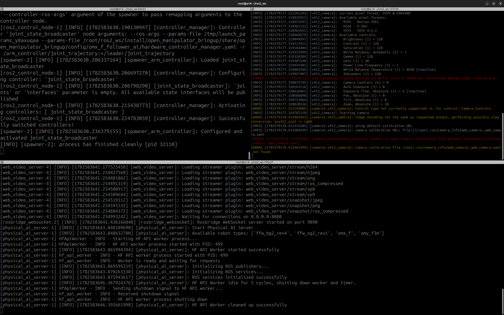
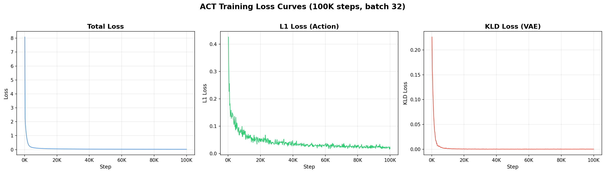
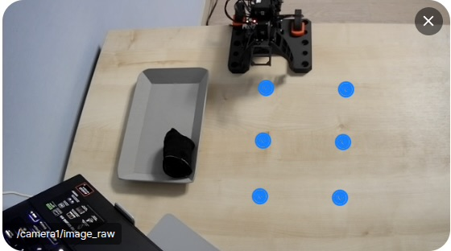

[한국어](README_KR.md) | [English](README.md)

# OMX-AI Imitation Learning — ACT-Based Pick and Place

Imitation learning experiment performing a Pick and Place task on the ROBOTIS OMX-AI robotic arm using ACT (Action Chunking with Transformers).

---

## Table of Contents

1. [Project Overview](#1-project-overview)
2. [Environment Setup](#2-environment-setup)
3. [Data Collection](#3-data-collection)
4. [Training](#4-training)
5. [Experimental Results](#5-experimental-results)
6. [Key Observations](#6-key-observations)
7. [Troubleshooting](#7-troubleshooting)
8. [Discussion](#8-discussion)
9. [References](#9-references)

---

## 1. Project Overview

| Item | Details |
|---|---|
| Robot | OMX-AI (ROBOTIS) |
| Task | Pick and Place |
| Policy | ACT (Action Chunking with Transformers) |
| Tools | Physical AI Tools, LeRobot, ROS2 |
| Dataset | 100 episodes, ~45,000 frames, 30fps, 1 camera |
| HuggingFace Dataset | [cheolhyunkim/omx_f_pick_and_place](https://huggingface.co/datasets/cheolhyunkim/omx_f_pick_and_place) |
| **Final Result** | **6/6 positions successful at 100K checkpoint (100% success rate)** |

The goal is to implement end-to-end imitation learning using human demonstrations as training data.

---

## 2. Environment Setup

### Hardware

- **Robot**: ROBOTIS OMX-AI (6-DOF)
- **Camera**: APKO APC890W, 30fps
- **Training GPU**: NVIDIA RTX 5060 8GB (Laptop)
- **Middleware**: ROS2 Jazzy

### Software Environment

| Item | Details |
|---|---|
| OS | Ubuntu 24.04 LTS |
| ROS2 | Jazzy |
| Container | Docker + NVIDIA Container Toolkit |
| Python | 3.12 |
| Training Framework | LeRobot (HuggingFace) |
| Robot Control | Physical AI Tools (ROBOTIS) |

### Runtime Environment



Terminal layout used in this project:

- **Top-left**: OMX node inside the open_manipulator Docker container
- **Top-right**: Camera node (v4l2_camera) inside the physical_ai_tools Docker container
- **Bottom**: Physical AI Tools server node inside the physical_ai_tools Docker container

---

## 3. Data Collection

| Item | Value |
|---|---|
| Number of Episodes | 100 |
| Total Frames | ~45,000 |
| Frame Rate | 30 fps |
| Resolution | 640×480 |
| Number of Cameras | 1 |
| Collection Method | Teleoperation (leader-follower) |
| Collection Tools | Physical AI Tools + LeRobot |

Each episode consists of a single Pick-and-Place cycle: picking up a target object and placing it in a designated tray.

### Data Collection Video


https://github.com/user-attachments/assets/cf648b12-937d-4c4f-a8f6-d8004809b01a


[Watch on YouTube](https://youtu.be/JBE216r2U6A)

---

## 4. Training

### Training Loss Graph



**Analysis:**
- **Total Loss**: Drops sharply within the first 5K steps and stabilizes after ~10K steps
- **L1 Loss** (action prediction): Converges to around 0.03 with minor fluctuations
- **KLD Loss** (VAE regularization): Converges to nearly 0 within 5K steps
- The fast convergence of KLD suggests the VAE encoder quickly learned a compact latent representation

### Hyperparameters

| Item | Value |
|---|---|
| Policy | ACT |
| Backbone | ResNet-18 |
| Batch Size | 32 |
| Training Steps | 100,000 |
| Learning Rate | 1e-5 |
| Training Time | ~18 hours |
| GPU | NVIDIA RTX 5060 8GB (Laptop) |
| Checkpoint Interval | 20,000 steps |

---

## 5. Experimental Results

### Evaluation Setup



Objects were placed at 6 fixed positions, and Pick-and-Place success was tested for each checkpoint. Position indices are as follows:

```
Robot
 ↓
[3] [6]
[2] [5]
[1] [4]
```

Position 3 is closest to the robot base; Positions 4, 5, and 6 are on the far side.

### Evaluation Protocol

Each checkpoint was evaluated by placing an object at each of the 6 fixed positions in the workspace. The robot attempts to pick up the object and place it in the tray.

**Legend:**
- ✅ = Success on first attempt
- ⚠️ = Conditional success (retry required or unstable grasping)
- ❌ = Failure

### Detailed Results by Position

| Checkpoint | Pos 1 | Pos 2 | Pos 3 | Pos 4 | Pos 5 | Pos 6 | 1st-Attempt Success Rate |
|---|---|---|---|---|---|---|---|
| 020k | ❌ | ✅ | ✅ | ✅ | ⚠️ retry | ❌ | 3/6 (50%) |
| 040k | ❌ | ✅ | ✅ | ✅ | ✅ | ✅ | 5/6 (83%) |
| 060k | ❌ | ✅ | ✅ | ✅ | ✅ | ✅ | 5/6 (83%) |
| 080k | ⚠️ retry | ✅ | ✅ | ✅ (unstable) | ✅ | ✅ | 5/6 (83%) |
| 100k | ✅ | ✅ | ✅ | ✅ | ✅ | ✅ | **6/6 (100%)** |

### Inference Videos by Checkpoint

#### 020k Steps (50%)


https://github.com/user-attachments/assets/f75c6cb0-0c7c-4a2c-b353-f82cd4706368


[Watch on YouTube](https://youtu.be/YuQHmx89cCM)

#### 040k Steps (83%)


https://github.com/user-attachments/assets/86a429f1-ef09-4f8b-81c1-7f09a9df7278


[Watch on YouTube](https://youtu.be/s6fwgxGGtAk)

#### 060k Steps (83%)


https://github.com/user-attachments/assets/4c0c1815-07ea-41c4-a213-9088dcde4e17


[Watch on YouTube](https://youtu.be/SJT8HtYSkhY)

#### 080k Steps (83%)


https://github.com/user-attachments/assets/6a597adb-4678-4a53-812d-b5b6f3d0a8f5


[Watch on YouTube](https://youtu.be/jNEdFIn7p0s)

#### 100k Steps (100%)


https://github.com/user-attachments/assets/5f69d5f6-e097-44fb-901f-c06e884674b9


[Watch on YouTube](https://youtu.be/jQcLh0VwcxY)

---

## 6. Key Observations

- **Perfect 6/6 success rate achieved at the 100K checkpoint** — sufficient training steps are critical for robust generalization across all positions
- **Position 1 was the hardest** — failed at 020k, 040k, and 060k; first succeeded (with retry) at 080k, suggesting relatively sparse training data coverage for that region
- **040k, 060k, and 080k all plateau at 83%** — performance stagnated in the mid-training range before a final jump at 100k
- **First success at Position 1 was at 080k** — required a retry but completed for the first time; unstable grasping was observed at Position 4 at 080k, though it succeeded on the first attempt
- **Performance progression (50% → 83% → 83% → 83% → 100%)** — a long plateau in the middle followed by a leap at the final checkpoint
- Early checkpoints (020k–060k) concentrated successes in the center and far regions (Positions 2, 3, 4, 5); the near-robot region (Position 1) required the most training

---

## 7. Troubleshooting

| Issue | Cause | Resolution |
|---|---|---|
| DYNAMIXEL motor unresponsive | Faulty cable connection causing FastBulkRead errors | Diagnosed with Dynamixel Wizard 2.0 and re-seated motor cables |
| v4l2_camera capturing wrong camera | USB device order changed on reboot, assigning the built-in IR camera | Identified correct device using `/sys/class/video4linux/video*/name` |
| DroidCam "Connection reset" error | v4l2loopback kernel module not loaded | Ran `sudo modprobe v4l2loopback` |

---

## 8. Discussion

#### Object Shape and Grasping Strategy

In a previous training run, a square box was used as the pick target. However, the gripper had to adjust its approach angle depending on which face of the box was presented, which proved problematic. Without a close-up camera mounted on the gripper, the model could not infer the correct grasp angle even with a proper training dataset. In future work, I would like to add a wrist-mounted camera and tackle the task of inferring grasp points on the object.

#### Importance of Data Quality

In the previous training run, noisy demonstrations were collected without much attention to quality — the gripper occasionally dropped the object mid-episode, and the operator's hand frequently entered and exited the camera frame. Training on such noisy data led the robot to exhibit erratic, inconsistent behavior far from what was demonstrated. This project reinforced how significantly data quality affects inference performance. Clean and consistent demonstration data is essential for successful imitation learning.

---

## 9. References

- [ACT: Action Chunking with Transformers](https://tonyzhaozh.github.io/aloha/) — Zhao et al., 2023
- [LeRobot](https://github.com/huggingface/lerobot) — HuggingFace
- [Physical AI Tools](https://github.com/ROBOTIS-GIT/physical_ai_tools) — ROBOTIS
- [ROBOTIS OMX-AI](https://www.robotis.com) — Robot Hardware
- [ROS2](https://docs.ros.org)
- Dataset: [cheolhyunkim/omx_f_pick_and_place](https://huggingface.co/datasets/cheolhyunkim/omx_f_pick_and_place)
- YouTube Playlist: [OMX-AI ACT Imitation Learning](https://www.youtube.com/playlist?list=PLPGPIB1GJkoY)
